# FM's for EHRs

This workflow can be used to reproduce the results in the accompanying manuscript. The bash scripts can be run in a slurm environment with the specified resource requirements. Each bash script calls one or more python scripts that depend on an environment as described in the `requirements.txt` file:

```sh
python3 -m venv venv
source venv/bin/activate
pip3 install torch torchvision torchaudio --index-url https://download.pytorch.org/whl/cu121
pip3 install -r requirements.txt
```

The code is structured logically as follows, where the numerical prefixes correspond to the prefixes in the bash (`.sh`) files:



<!--

Send code:
```sh
rsync -avht \
      --exclude "venv/" \
      --exclude ".idea/" \
      --exclude "output/" \
      --exclude "wandb/" \
      --exclude "results/" \
      ~/Documents/chicago/clif-tokenizer \
      randi:/gpfs/data/bbj-lab/users/burkh4rt
```

Update venv:
```sh
pip3 list --format=freeze > requirements.txt
```

Grab development sample:
```sh
export hm=/gpfs/data/bbj-lab/users/burkh4rt
rsync -avht \
    --delete \
    randi:${hm}/clif-development-sample \
    ~/Documents/chicago/CLIF/
```

Format:
```
isort *.py
black *.py
shfmt -w *.sh
prettier --write --print-width 81 --prose-wrap always *.md
```

Run on randi:
```
systemd-run --scope --user tmux new -s t2q
srun -p tier2q \
  --mem=25GB \
  --time=8:00:00 \
  --job-name=adhoc \
  --pty bash -i
source venv/bin/activate
```

Troubleshoot:
```
systemd-run --scope --user tmux new -s gpuq
srun -p gpuq \
  --gres=gpu:1 \
  --time=8:00:00 \
  --job-name=adhoc \
  --pty bash -i
. venv/bin/activate
jupyter notebook --no-browser --ip=0.0.0.0 --port=8088
ssh -L 8088:localhost:8088 cri22cn401
```

Grab features and outcomes:
```
export hm=/gpfs/data/bbj-lab/users/burkh4rt
rsync -avht \
    --exclude "**/tokens_timelines.parquet" \
    randi:${hm}/clif-data/first-24h-tokenized \
    ~/Documents/chicago/clif-tokenizer/results
```

jid=sbatch --parsable 02_tokenize_train_val_test_split.sh
cat output/${jid}.stdout

-->
