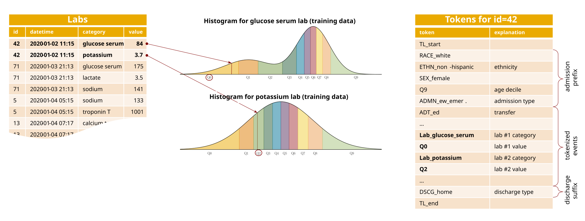
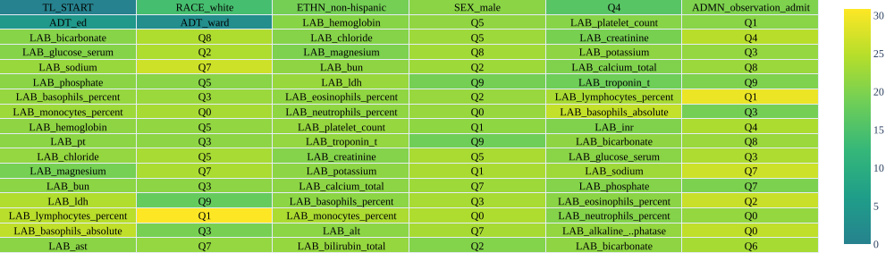

# FMs-EHRs

> This repo contains code to tokenize electronic health records, train foundation
> models on those tokenized records, and then perform various downstream
> analyses. [^1] [^2]

## Used in: Input Representation Benchmark

The [`input-representation-benchmark`](../input-representation-benchmark) sibling repo
uses this repo as a **library** for the MLHC 2026 benchmark paper. It adds `fms-ehrs/`
to `PYTHONPATH` via `slurm/00_preamble.sh` and calls the following scripts directly:

| Script | Stage | Purpose |
|---|---|---|
| `fms_ehrs/scripts/tokenize_w_config.py` | Stage 0 | Tokenize MEDS → sequences |
| `fms_ehrs/scripts/train_representation.py` | Stage 1 | Train causal LM (via `torchrun`) |
| `fms_ehrs/scripts/extract_hidden_states.py` | Stage 2 | Extract last hidden state at 24h cutoff |
| `fms_ehrs/scripts/transfer_rep_based_preds.py` | Stage 3 | LR/MLP probes on hidden states |
| `fms_ehrs/scripts/eval_token_ce.py` | Diagnostics | Per-token cross-entropy analysis |

For the full pipeline description, see [`input-representation-benchmark/PIPELINE.md`](../input-representation-benchmark/PIPELINE.md).

## Requirements & structure

The bash scripts can be run in a [slurm](https://slurm.schedmd.com) environment
with the specified resource requirements. (We used compute nodes with 8×A100
40GB-PCIe GPUs, connected with 2×16-core 3.0-GHz AMD Milan processors for
GPU-based work.) Each bash script calls one or more python scripts that depend on
an environment as described in the `requirements.txt` file. You can set up an
environment with [pytorch](https://pytorch.org/get-started/locally/) configured
for CUDA 12.8 with [uv](https://docs.astral.sh/uv/pip/) as follows:

```sh
uv venv --python=$(which python3) venv
. venv/bin/activate
uv pip install --torch-backend=cu128 --link-mode=copy -e .
```

For plots to render correctly, you may need to install a working version of
[tex](https://www.tug.org/texlive/) on your system.

## What the code does

This repository orchestrates the processing of hospitalization events for adult patients (≥18 years) from two sources: the Beth Israel Deaconess Medical Center (MIMIC-IV-3.1, 2008–2019) and UCMC (March 2020–March 2022). All records are restricted to hospital stays of at least 24 hours and mapped to the [CLIF-2.0.0 format](https://web.archive.org/web/20250711203935/https://clif-consortium.github.io/website/data-dictionary/data-dictionary-2.0.0.html).

The MIMIC cohort is partitioned into training, validation, and test datasets at a 70/10/20 split based on the randomized timestamp of each patient's first recorded hospitalization. Consequently, hospitalization records in the test set correspond exclusively to unseen patients. The UCMC data serves primarily as an external validation set and employs a 5/5/90 training/validation/test split using identical methodology.

## Experiment 3 cohort definition (input-representation-benchmark)

The companion benchmark (`input-representation-benchmark`) defines an explicit ICU-hospitalization cohort
\(H_{\mathrm{ICU}}\) for Experiment 3 (vocabulary semantics). When using the Exp3 tokenizer configs
`fms_ehrs/config/mimic-meds-exp3-icu.yaml` (MEDS),
the input data directories are assumed to already be filtered to \(H_{\mathrm{ICU}}\):

- **Hospitalization-level inclusion (\(H_{\mathrm{ICU}}\))**: MIMIC-IV admissions (`hadm_id`) with hospital
  LOS \(\ge\) 24h (computed from `hosp/admissions.csv.gz` `admittime`/`dischtime`) AND \(\ge\)1 linked ICU stay
  record in `icu/icustays.csv.gz` for the same `hadm_id`.
- **Splitting**: patient-level 70/10/20 split by `subject_id` with a fixed RNG seed, then split-specific `hadm_id`
  lists are derived by intersecting admissions for those patients with \(H_{\mathrm{ICU}}\)
  (see `input-representation-benchmark/scripts/align_cohorts.py`).

The pipeline converts each hospitalization event into a sequence of integer tokens. A sequence begins with a timeline-start token, followed by an "admission prefix"—five tokens capturing race, ethnicity, sex, age (as a decile limit), and admission type.

Subsequent clinical events are injected sequentially. Transfers map directly to CLIF location categories. Laboratory results generate two tokens simultaneously: a category token and a value token discretized against training-set deciles. This design—tokenizing the category then appending its quantile-binned value—constitutes "category-value tokenization":



This category-value template applies broadly across tables, including vitals, assessment outcomes, and medication classes. Respiratory support records specify both mode and device categories. Prone positioning is captured via a boolean token. Synchronous events occurring at identical timestamps appear coterminously. Finally, timelines conclude with a discharge category token and a dedicated timeline-end token.

An example sequence initialization:



## Usage notes

-   We now have a configurable generic tokenizer and preprocessing scripts. See
    [notes](notes/generic-tokenizer.md) for further details.

-   Credentialed users may obtain the
    [MIMIC-IV-3.1 dataset](https://physionet.org/content/mimiciv/3.1/) from
    Physionet. [This repo](https://github.com/bbj-lab/CLIF-MIMIC) contains
    instructions and code for converting it to the
    [CLIF-2.0.0 format](https://web.archive.org/web/20250711203935/https://clif-consortium.github.io/website/data-dictionary/data-dictionary-2.0.0.html).
    (Use the [v0.1.0](https://github.com/bbj-lab/CLIF-MIMIC/releases/tag/v0.1.0)
    release.) The `rclif-2.0` folder location is then passed as `--data_dir_in`
    to the [first slurm script](./slurm/01_create_data_splits.sh).

-   Many of the slurm scripts assume a folder structure as follows, where
    `tree ${hm}` (_cf_
    [tree](https://manpages.ubuntu.com/manpages/noble/man1/tree.1.html)) looks
    something like this:

    ```sh
    .
    ├── data-mimic # MIMIC datasets
    │   ├── raw
    │   │   ├── test
    │   │   │   ├── clif_adt.parquet
    │   │   │   ├── ...
    │   │   │   └── clif_vitals.parquet
    │   │   ├── train
    │   │   │   ├── clif_adt.parquet
    │   │   │   ├── ...
    │   │   │   └── clif_vitals.parquet
    │   │   └── val
    │   │       ├── clif_adt.parquet
    │   │       ├── ...
    │   │       └── clif_vitals.parquet
    │   ├── ...
    │   └── W++_first_24h-tokenized
    │       ├── test
    │       │   └── tokens_timelines.parquet
    │       ├── train
    │       │   ├── tokens_timelines.parquet
    │       │   └── vocab.gzip
    │       └── val
    │           └── tokens_timelines.parquet
    ├── data-ucmc  # UCMC datasets
    │   └── ...
    ├── mdls  # to hold all models generated
    │   └── ...
    ├── mdls-archive  # models for long-term storage
    │   └── llama-med-60358922_1-hp-W++
    │       ├── config.json
    │       ├── generation_config.json
    │       └── model.safetensors
    ├── Quantifying-Surprise-EHRs  # THIS REPO
    │   └── ...
    └── figs  # for generated figures
    ```

    Tokenized datasets are deposited into the `data-mimic` or `data-ucmc` folder,
    depending on data provenance. Trained models are stored in `mdls`. Many
    models are generated and these take up significant amounts of space. Models
    to be kept are copied into `mdls-archive`. Generated figures are placed in
    the `figs` folder.

-   Slurm jobs can be queued in sequence as follows:

    ```sh
    j01=$(sbatch --parsable 01_create_train_val_test_split.sh)
    j02=$(sbatch --parsable --depend=afterok:${j01} 02_tokenize_train_val_test_split.sh)
    j03=$(sbatch --parsable --depend=afterok:${j02} 03_extract_outcomes.sh)
    ...
    ```

-   If you find yourself manually running python scripts from an interactive
    slurm job afer running `preamble.sh`, you can append:

    ```sh
    2>&1 | tee -a output/$SLURM_JOBID-$jname.stdout
    ```

    to keep logs.

-   _Note_: We've started experimenting with
    [apptainer](https://apptainer.org)-based containerization, a successor to
    [singularity](https://singularityware.github.io/index.html). In an
    environment with apptainer available (e.g.
    `/gpfs/data/bbj-lab/.envs/apptainer`), you can define something like

    ```sh
    export hm="/gpfs/data/bbj-lab/users/$(whoami)"
    python3() {
        apptainer exec --bind $hm:$hm --nv /gpfs/data/bbj-lab/users/burkh4rt/env.sif python3 "$@"
    }
    ```

    and then your calls to python3 will be using it. This is considered
    experimental; any feedback is welcome.

    You can can also create your own version of this container with:

    ```sh
    conda activate apptainer
    export TMPDIR="/scratch/$(whoami)/cache"
    export APPTAINER_TMPDIR="/scratch/$(whoami)/cache"
    export APPTAINER_CACHEDIR="/scratch/$(whoami)/cache"

    apptainer build env.sif env.def
    ```

[^1]:
    M. Burkhart, B. Ramadan, Z. Liao, K. Chhikara, J. Rojas, W. Parker, & B.
    Beaulieu-Jones, Foundation models for electronic health records:
    representation dynamics and transferability,
    [arXiv:2504.10422](https://doi.org/10.48550/arXiv.2504.10422)

[^2]:
    M. Burkhart, B. Ramadan, L. Solo, W. Parker, & B. Beaulieu-Jones, Quantifying
    surprise in clinical care: detecting highly informative events in electronic
    health records with foundation models,
    [arXiv:2507.22798](https://doi.org/10.48550/arXiv.2507.22798)

<!--

Format:
```
ruff format .
ruff check .
shfmt -w slurm/
```

Send to randi:
```
rsync -avht \
  --delete \
  --exclude "slurm/output/" \
  --exclude "venv/" \
  --exclude ".idea/" \
  ~/Documents/chicago/fms-ehrs-reps \
  randi:/gpfs/data/bbj-lab/users/burkh4rt
```

Run on randi:
```
systemd-run --scope --user tmux new -s t3q || tmux a -t t3q
srun -p tier3q \
  --mem=100GB \
  --time=8:00:00 \
  --job-name=adhoc \
  --pty bash -i
source venv/bin/activate
```

Troubleshoot:
```
systemd-run --scope --user tmux new -s gpuq || tmux a -t gpuq
srun -p gpudev \
  --gres=gpu:1 \
  --time=8:00:00 \
  --job-name=adhoc \
  --pty bash -i
. venv/bin/activate
jupyter notebook --no-browser --ip=0.0.0.0 --port=8088
ssh -L 8088:localhost:8088 cri22cn401
```

Grab generated plots:
```
rsync -avht \
    randi:/gpfs/data/bbj-lab/users/burkh4rt/figs \
    ~/Downloads
```

Grab dev sample:
```
rsync -avht \
    --delete \
    randi:/gpfs/data/bbj-lab/users/burkh4rt/development-sample-21 \
    ~/Downloads
```

Save environment:
```
uv pip compile --torch-backend=cu128 pyproject.toml -o requirements.txt
```

Get fonts on randi:
```
mkdir -p ~/.local/share/fonts/CMU
cd ~/.local/share/fonts/CMU
wget https://mirrors.ctan.org/fonts/cm-unicode.zip
unzip cm-unicode.zip
find . -type f \( -iname "*.ttf" -o -iname "*.otf" \) -exec mv {} ~/.local/share/fonts/CMU/ \;
fc-cache -f -v
fc-list | grep -i cmu
```

Install directly from github:

```sh
pip install -e "git+https://github.com/bbj-lab/clif-tokenizer.git@main#egg=fms-ehrs"
```

Fix permissions:

```sh
chgrp -R cri-bbj_lab . && chmod -R +770 .
```
-->
