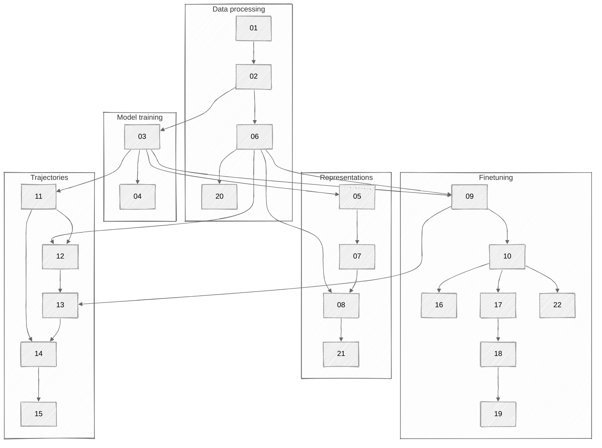

# FMs for EHRs

> This workflow can be used to reproduce the results in the accompanying
> manuscript [^1].

## Requirements & structure

The bash scripts can be run in a slurm environment with the specified resource
requirements. (We used compute nodes with 8×A100 GPUs, connected with 2×16-core
3.0-GHz AMD Milan processors for GPU-based work.) Each bash script calls one or
more python scripts that depend on an environment as described in the
`requirements.txt` file:

```sh
python3 -m venv venv
source venv/bin/activate
pip3 install torch torchvision torchaudio --index-url https://download.pytorch.org/whl/cu121
pip3 install -r requirements.txt
```

Alternatively, after installing torch, you can install directly from github:

```sh
pip install -e git+https://github.com/bbj-lab/clif-tokenizer.git@main
```

or

```sh
pip install -e "git+https://github.com/bbj-lab/clif-tokenizer.git@main#egg=fms-ehrs"
```

for an editable installation.

The code is structured logically as follows, where the numerical prefixes
correspond to the prefixes in the bash (`.sh`) files:



## What the code does

### Data wrangling & tokenization

The code operates on MIMIC tabular data converted to the
[CLIF-2.0.0 format](https://clif-consortium.github.io/website/data-dictionary.html).
It gathers data associated to a given `hospitalization_id` and generates a
sequence of integers corresponding to the stay. Each sequence begins with a start
token, information about the patient, information about the stay itself, and then
encoded category-value pairs corresponding to, inter alia, lab records, vitals,
and medication. The sequences end with information on discharge and an end token,
like so:


Category-value tokenization iterates over all categories present in a table and
learns deciles for the values within each category. For example, the vital
corresponding to temperature in Celsius may be assigned the integer label ‘33.’
All measurements of temperature in the training set are used to determine deciles
for measurements within this category. For hospitalization 42, the tokens ‘33’
for this category and then ‘0’ for the corresponding deciled measurement would be
inserted into the timeline at ‘E1’:


### Self-supervised training

Our training process packs sequences together, allowing one sequence to bleed
into the next example within a batch. The dark goldenrod boundary outlines tokens
corresponding to two individual hospitalization events:


We insert a variable number of padding tokens between sequences to expose the
model to padding. For the initial training, the model attempted to predict the
next token in a sequence given the previous tokens (‘context’).

### Objective-specific finetuning

We perform supervised fine-tuning with left-padded sequences. Each
hospitalization event (truncated at 24 hours) occupies a single training instance
and is paired with its associated subsequent outcome. In this way, fine-tuning is
outcome-specific.


### Representation extraction and analysis

Our pipeline extracts model-specific representations for each hospitalization
event that our useful for predicting a number of subsequent outcomes.

## Usage notes

Queue slurm jobs with dependencies as follows:

```sh
j01=$(sbatch --parsable 01_create_train_val_test_split.sh)
j02=$(sbatch --parsable --depend=afterok:${j01} 02_tokenize_train_val_test_split.sh)
j03=$(sbatch --parsable --depend=afterok:${j02} 03_tune_model.sh)
```

---

[^1]:
    M. Burkhart, B. Ramadan, Z. Liao, K. Chhikara, J. Rojas, W. Parker, & B.
    Beaulieu-Jones, Foundation models for electronic health records:
    representation dynamics and transferability,
    [arXiv:2504.10422](https://doi.org/10.48550/arXiv.2504.10422)

<!--

Format:
```
isort fms_ehrs/
black fms_ehrs/
shfmt -w slurm/
prettier --write --print-width 81 --prose-wrap always *.md
```

Send to randi:
```
rsync -avht \
  --delete \
  --exclude "slurm/output/" \
  --exclude "venv/" \
  --exclude ".idea/" \
  ~/Documents/chicago/fms-ehrs-reps \
  randi:/gpfs/data/bbj-lab/users/burkh4rt
```

Run on randi:
```
systemd-run --scope --user tmux new -s t2q
srun -p tier2q \
  --mem=25GB \
  --time=8:00:00 \
  --job-name=adhoc \
  --pty bash -i
source venv/bin/activate
```

Troubleshoot:
```
systemd-run --scope --user tmux new -s gpuq
srun -p gpuq \
  --gres=gpu:1 \
  --time=8:00:00 \
  --job-name=adhoc \
  --pty bash -i
. venv/bin/activate
jupyter notebook --no-browser --ip=0.0.0.0 --port=8088
ssh -L 8088:localhost:8088 cri22cn401
```

Grab generated plots:
```
rsync -avht \
    randi:/gpfs/data/bbj-lab/users/burkh4rt/figs \
    ~/Downloads
```

Save environment:
```
pip list --format=freeze > requirements.txt
```

Get fonts on randi:
```
mkdir -p ~/.local/share/fonts/CMU
cd ~/.local/share/fonts/CMU
wget https://mirrors.ctan.org/fonts/cm-unicode.zip
unzip cm-unicode.zip
find . -type f \( -iname "*.ttf" -o -iname "*.otf" \) -exec mv {} ~/.local/share/fonts/CMU/ \;
fc-cache -f -v
fc-list | grep -i cmu
```

-->
