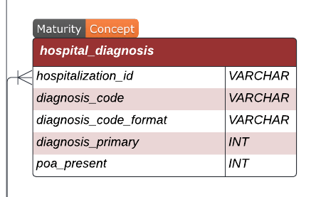

# Adding an outcome

Suppose there's some outcome you'd like to consider. Some outcomes correspond
precisely to the existence of a token already included in our tokenization
process. For example, same-admission mortality occurs when a `DSCG_expired` token
exists in a given timeline. Some correspond to tokenized events that need to
happen after the 24-hour observation window concludes, like an IMV (invasive
mechanical ventillation) event (for persons who do not have one in the first 24h
of their stay). This corresponds to the `RESP_IMV` token and we create two
flags[^1], one for IMV during the stay and one for an IMV event during the first
24h of the stay (see `imv_event` and `imv_event_24h` in
[extract_outcomes.py](../fms_ehrs/scripts/extract_outcomes.py)). In both cases,
we're examining the tokens corresponding to the full timelines (used during
training) and the timelines up to the 24h cutoff point (used for making
predictions).

Some outcomes can correspond to a single token under a reconfigured tokenization
process. For example, by configuring:

```yaml
options:
    quantizer: ventiles # 20 bins
    fused_category_values: !!bool false
```

then `VTL_sbp_Q0` corresponds to an instance of extreme hypotension (a systolic
blood pressure reading in the lowest ventile). However, in many cases, an outcome
of interest corresponds to some piece of data that was not previously available
in token form and needs to be added to the timelines.

## Time-based outcomes

These outcomes correspond to events that happen at a certain time for a given
patient. For example, we can compute SOFA scores[^2] for sepsis[^3] using the
[clifpy](https://common-longitudinal-icu-data-format.github.io/clifpy/) package.
Running [00_run_sofa.sh](../slurm/00_run_sofa.sh) calls
[run_sofa_scoring.py](../fms_ehrs/scripts/run_sofa_scoring.py) which creates a
table `clif_sofa.parquet` that includes columns:

-   hospitalization_id
-   event_time
-   sofa_cv_97
-   sofa_cns
-   sofa_coag
-   sofa_liver
-   sofa_renal
-   sofa_resp

This table was created after the original data split was made, and so required us
to run the [01_partition_posthoc.sh](../slurm/01_partition_posthoc.sh) script to
take the table located at `--new_data_loc` and insert tables of the same name
into the training, validation, and test splits of the partitioned dataset with
the
[partition_posthoc_w_config.py](../fms_ehrs/scripts/partition_posthoc_w_config.py)
function.

We can include tokens for each of these measurements by adding the following
snippet to our configuration file
[config-21++.yaml](../fms_ehrs/config/config-21++.yaml) we use to run the
tokenization process:

```yaml
- table: clif_sofa
  prefix: SOFA
  with_col_expr:
      - (pl.lit("cv-") + pl.col("sofa_cv_97").cast(str)).alias("cv")
      - (pl.lit("cns-") + pl.col("sofa_cns").cast(str)).alias("cns")
      - (pl.lit("coag-") + pl.col("sofa_coag").cast(str)).alias("coag")
      - (pl.lit("liver-") + pl.col("sofa_liver").cast(str)).alias("liver")
      - (pl.lit("renal-") + pl.col("sofa_renal").cast(str)).alias("renal")
      - (pl.lit("resp-") + pl.col("sofa_resp").cast(str)).alias("resp")
  code:
      - cv
      - cns
      - coag
      - liver
      - renal
      - resp
  time: event_time
```

This causes tokens `SOFA_cv-0`, ..., `SOFA_cv-4`, and so on for each type of
score to be inserted at `event_time` into the respective timelines.

## Time-agnostic outcomes

Some outcomes are not associated with a specific time stamp. For example,
[ICD-10-CM](https://www.cdc.gov/nchs/icd/icd-10-cm/index.html) billing codes are
assigned to a hospitalization after discharge, and so can be appended to the
suffix of a timeline that corresponds to information that only becomes available
after a stay[^4]. The CLIF-2.1 format provides this information in a table:

.

We can add this information to the reference table with this configuration:

```yaml
# join other tables to the reference table
augmentation_tables:
    # ...

    - table: clif_hospital_diagnosis
      key: hospitalization_id
      filter_expr: pl.col("diagnosis_primary") == 1
      with_col_expr: pl.col("diagnosis_code").str.split(".").list.first().alias("primary_dx_type")
      agg_expr: pl.col("primary_dx_type").sort().alias("primary_dx_types")
      validation: "1:1"

    - table: clif_hospital_diagnosis
      key: hospitalization_id
      filter_expr: pl.col("diagnosis_primary") == 0
      with_col_expr: pl.col("diagnosis_code").str.split(".").list.first().alias("dx_type")
      agg_expr: pl.col("dx_type").sort().alias("non_primary_dx_types")
      validation: "1:1"
```

We can then append these columns from the reference table after the discharge
information in timeline suffixes:

```yaml
suffix:
    # ...

    - column: primary_dx_types
      prefix: DX
      is_list: !!bool true

    - column: non_primary_dx_types
      prefix: DX
      is_list: !!bool true
```

This gives us tokens: `DX_I11`, `DX_I61`, `DX_C01`, `DX_A40`, `DX_J10`, etc. The
`DX_J10` token for example corresponds to hospital stays that subsequently
recieve a diagnosis / billing code with a
[J10 prefix](https://www.icd10data.com/ICD10CM/Codes/J00-J99/J09-J18/J10-) for
"Influenza due to other identified influenza virus".

[^1]:
    This is unnecessary for same-admission mortality, because we filter out all
    hospitalizations that are <24 hours in length.

[^2]:
    Vincent JL, Moreno R, Takala J, et al.
    [The SOFA (Sepsis-related Organ Failure Assessment) score to describe organ dysfunction/failure](https://doi.org/10.1007/BF01709751).
    Intensive Care Med. 1996;22(7):707-710.

[^3]:
    Singer M, Deutschman CS, Seymour CW, et al.
    [The Third International Consensus Definitions for Sepsis and Septic Shock (Sepsis-3)](https://doi.org/10.1001/jama.2016.0287).
    JAMA. 2016;315(8):801-810.

[^4]:
    Ramadan B, Liu M-C, Burkhart M, Parker W, Beaulieu-Jones, B.
    [Diagnostic codes in AI prediction models and label leakage of same-admission clinical outcomes](https://doi.org/10.1101/2025.08.09.25333360).
    JAMA Netw Open (in press).
