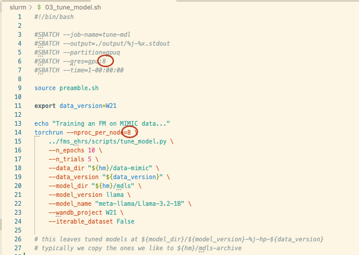
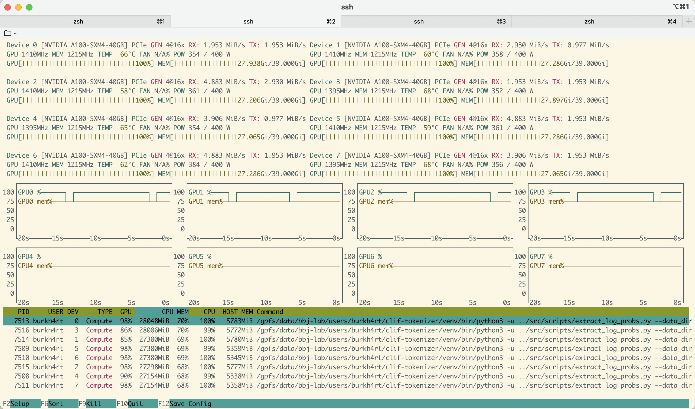
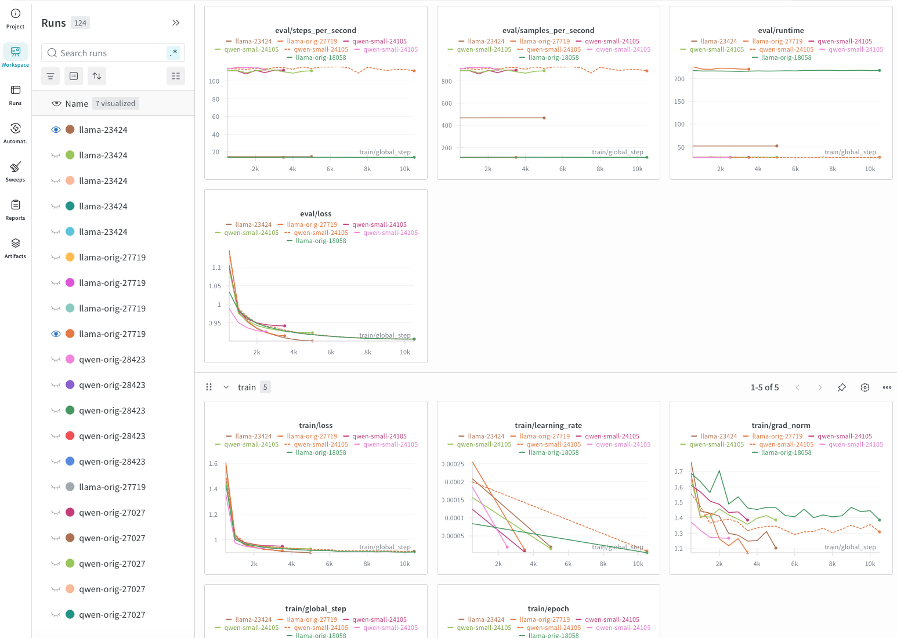
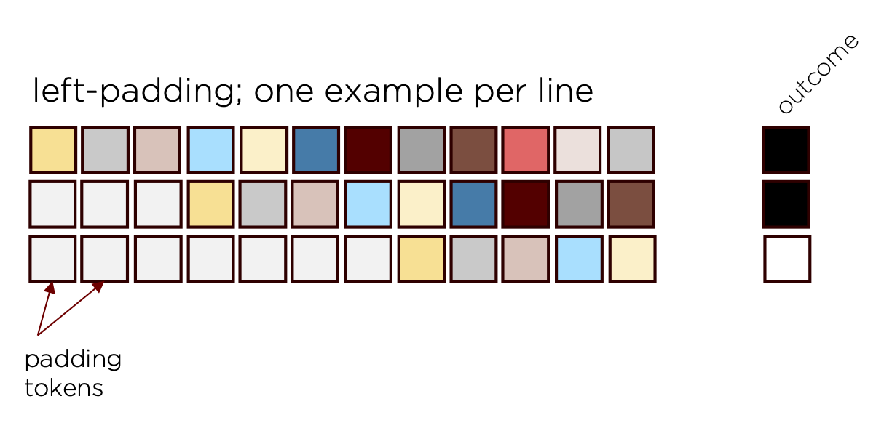

# Training models on randi

1. Code should be placed on randi, with something like:

    ```sh
    rsync -avht \
    --delete \
    --exclude "slurm/output/" \
    --exclude "venv/" \
    --exclude ".idea/" \
    . \
    randi:/gpfs/data/bbj-lab/users/$(whoami)
    ```

2. We typically train on the `gpuq` partition. We request gpus as a type of
   [general resource](https://slurm.schedmd.com/gres.html) with something like
   `#SBATCH --gres=gpu:8` to get 8×A100 (40GB PCIe) GPUs. If you don't need 8,
   then you can decrease this number, but make sure to also change
   `--nproc-per_node=8` to match whatever you request:

    

    Specify memory requirements with `--mem-per-cpu`.

<!-- prettier-ignore-start -->
> [!NOTE]
>  If you don't occupy a full node, you may encounter port conflicts
> with other people running jobs. To handle these, see this
> [doc](https://docs.pytorch.org/docs/stable/elastic/run.html#stacked-single-node-multi-worker)
> and consider adding the following `rdzv` lines:
> ```py
> torchrun --nproc_per_node=2 \
>    --rdzv_backend c10d \
>    --rdzv-id "$SLURM_ARRAY_TASK_ID" \
>    --rdzv-endpoint=localhost:0 \
>   ../fms_ehrs/scripts/XXX.py \
> ```
<!-- prettier-ignore-end -->

3. After your job starts to run, you'll be able to ssh directly into the node
   running the job (see our documentation for setting this up and a general intro
   to slurm
   [here](https://github.com/bbj-lab/cri-getting-started/blob/main/slurm.md)).
   You can run `nvtop` (https://github.com/Syllo/nvtop) and make sure you are
   actually using all the resources you requested. It looks like this:
   

<!-- prettier-ignore-start -->
> [!NOTE]
> If you run `nvtop` and some of the gpus are consistently at zero,
> you're not using them and may want to check your approach.
<!-- prettier-ignore-end -->

4. Our default script sends training data and metrics to a visualization platform
   called [weights and biases](wandb.ai). You can monitor eval loss / train loss
   / learning rate and more in real time: . Contact Michael
   to get added to our w&b team.

5. The actual training itself is handled almost entirely by huggingface:

    ```py
    training_args = SFTConfig(
        report_to="wandb",
        run_name="{m}-{j}".format(m=model_version, j=jid),
        max_seq_length=max_seq_length,
        output_dir=str(output_dir),
        per_device_train_batch_size=per_device_train_batch_size,
        per_device_eval_batch_size=4,
        max_grad_norm=max_grad_norm,
        num_train_epochs=1,  # this is handled in our dataset object
        save_total_limit=1,
        metric_for_best_model="eval_loss",
        load_best_model_at_end=True,
        greater_is_better=False,
        eval_strategy="steps",
        save_strategy="best",
        max_steps=max_steps,
        ddp_find_unused_parameters=False,
    )

    trainer = SFTTrainer(
        model=model_init(),
        model_init=model_init,
        train_dataset=dataset.get_train_dataset(
            n_epochs=n_epochs, iterable=iterable_dataset
        ),
        eval_dataset=dataset.get_val_dataset(iterable=iterable_dataset),
        args=training_args,
        callbacks=[
            EarlyStoppingCallback(early_stopping_patience=3),
            NanStoppingCallback(),
        ],
    )

    best_trial = trainer.hyperparameter_search(
        direction="minimize",
        backend="optuna",
        hp_space=optuna_hp_space,
        n_trials=n_trials,
    )
    ```

6. In contrast, finetuning runs a bit differently. We use a padding strategy
   there (and it's important that the model we're fine-tuning already knows about
   the existence of padding tokens). With padding, we place a single example in
   each row (and these sequences are truncated at 24h -- in the same way that
   they are when we test on them), but since each sequence has a different
   length, we use the padding tokens as filler in order to form them into
   batches:

    .

    The code to create the fine-tuning dataset looks like:

    ```py
    dataset = (
        ds.load_dataset(
            "parquet",
            data_files={
                s: str(data_dirs[s].joinpath("tokens_timelines_outcomes.parquet"))
                for s in splits
            },
            columns=["padded", outcome],
        )
        .with_format("torch")
        .map(
            lambda x: {
                "input_ids": rt_padding_to_left(
                    x["padded"], vocab("PAD"), unif_rand_trunc=unif_rand_trunc
                ),
                "label": x[outcome],
            },
            remove_columns=["padded", outcome],
        )
    )
    ```

    where:

    ```py
    def rt_padding_to_left(
        t_rt_pdd: t.Tensor, pd_tk: int, unif_rand_trunc: bool = False
    ) -> t.Tensor:
        """
        take a tensor `t_rt_pdd` padded on the right with padding token `pd_tk` and
        move that padding to the left; if `unif_rand_trunc`, truncate sequence
        uniformly at random
        """
        i = t.argmax(
            (t_rt_pdd == pd_tk).int()
        ).item()  # either the index of the first padding token or 0
        if unif_rand_trunc and i > 0:
            i = t.randint(
                low=1, high=i, size=(1,)
            ).item()  # new cut-point chosen uniformly at random from seq length
        return (
            t.concat([t.full((t_rt_pdd.shape[0] - i,), pd_tk), t_rt_pdd[:i]])
            if i > 0
            else t_rt_pdd  # if no padding was present
        )
    ```

    The tuning itself is again mostly huggingface:

    ```py
    training_args = TrainingArguments(
        report_to="wandb",
        run_name="{m}-{j}".format(m=model_loc.stem, j=jid),
        output_dir=str(output_dir),
        per_device_train_batch_size=per_device_train_batch_size,
        per_device_eval_batch_size=per_device_eval_batch_size,
        gradient_accumulation_steps=gradient_accumulation_steps,
        learning_rate=learning_rate,
        num_train_epochs=n_epochs,
        save_total_limit=2,
        metric_for_best_model=metric_for_best_model,
        greater_is_better=greater_is_better,
        load_best_model_at_end=True,
        eval_strategy="epoch",
        save_strategy="best",
        ddp_find_unused_parameters=False,
    )

    trainer = Trainer(
        model=model_init(),
        model_init=model_init if tune else None,
        train_dataset=dataset["train"].shuffle(generator=np_rng),
        eval_dataset=dataset["val"],
        args=training_args,
        callbacks=[EarlyStoppingCallback(early_stopping_patience=3)],
        compute_metrics=compute_metrics,
    )
    ```
